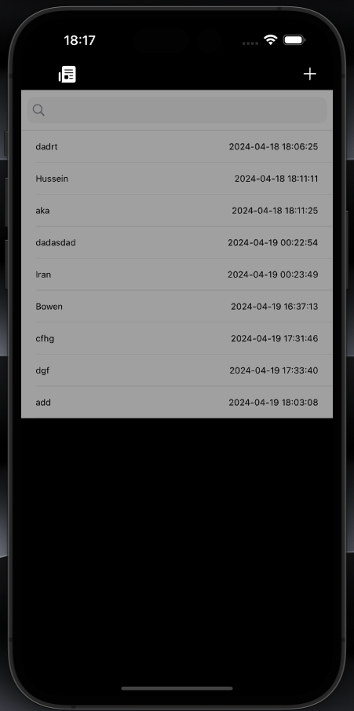
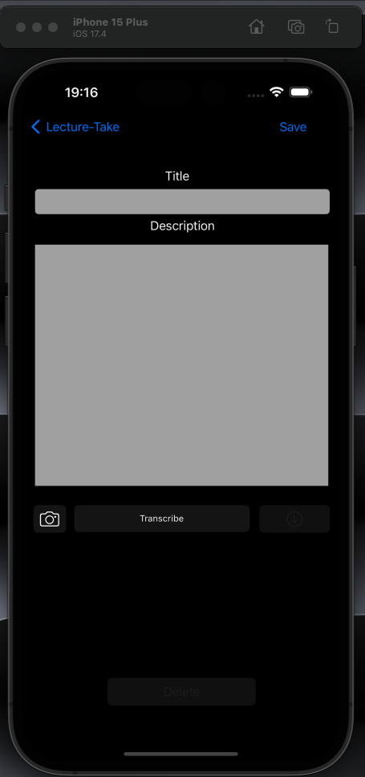
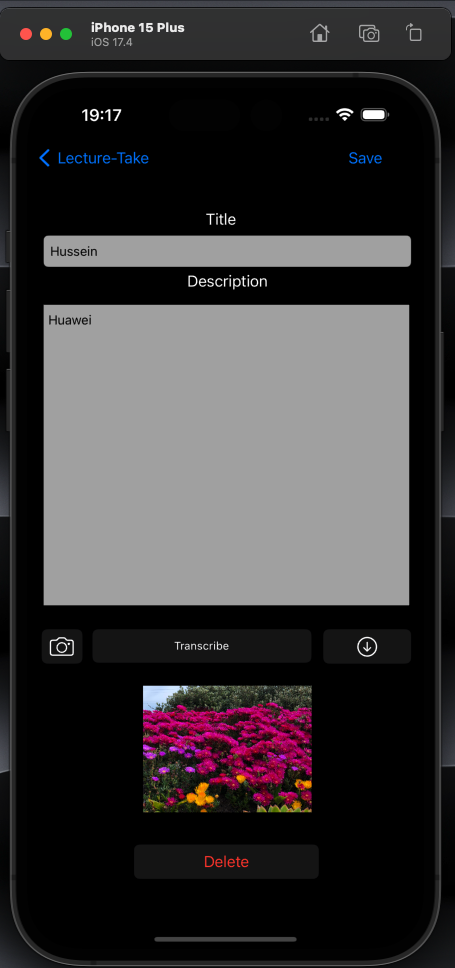
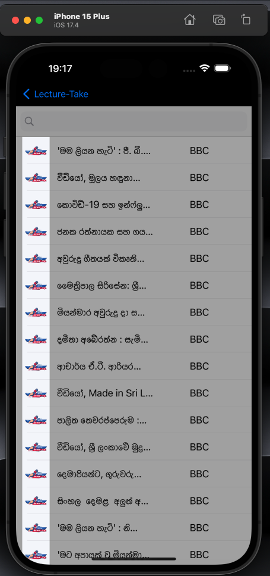

# Lecture-Take

#### 01. Brief Description of Project - Lecture-Take is an app that allows students to save references during a lecture. For example in DSA if there is a need to have a look on quick sort algorithm the user can type and save Quicksort - Pg 10 and title as DSA with a picture of the lectures explanation on the board. There by the student can have a later look on what he needs to focus more on that particular lecture. Further all local news is also being displayed from my api available @ rapid api 
#### 02. Users of the System - Students
#### 03. What is unique about your solution - It's a one stop for students and unlike other note taking apps goodnotes my app is mainly focused on saving the reference for a later look and with the transcribe functionality the student can also transcribe on what the lecturer is saying.
#### 04. Briefly document the functionality of the screens you have (Include screen shots of images)
 The first screen is used to view all the saved notes.

  

 The add screen is used to add a note.

  

e.g. The view and edit screen is used to view note and edit it (Note: image could be enlarged).

  

 The news screen is used to local news fetched from the api.

  

#### 05. Give examples of best practices used when writing code
In the below code structure is being use on Codable so that the json could be encoded and decoded, Comments are being added, variable names are being used based on best practices

```
import UIKit
import SafariServices

//Use of codable for encoding and decoding the json
struct NewsItem: Codable {
    let title: String
    let source: String
}

//Class for the news table
class NewsTableViewController: UITableViewController {
    
    var newsItems: [NewsItem] = [] //Array for retrived news item from api
    var filteredNewsItems: [NewsItem] = [] //Filtered data via search
    var isLoading = false //bool for loader
    
    @IBOutlet var searchBar: UISearchBar! //Searchbar reference
    
    let activityIndicator = UIActivityIndicatorView(style: .medium)
    let noDataLabel = UILabel()
    
    override func viewDidLoad() {
        super.viewDidLoad() //fetching data from rapid api 
        
        setupUI()
        fetchData(from: "https://latest-sri-lankan-news.p.rapidapi.com/latest-news/deshaya/1") //fetching data from rapid api
        fetchData(from: "https://latest-sri-lankan-news.p.rapidapi.com/latest-news/bbcsinhala") //fetching data from rapid api
        
        filteredNewsItems = newsItems //loading all news data to the filtered array
    }
    
```
In the below code error handling is being done inorder to handle errors properly. Catch and condition are being used. Moreover alerts are being given to the user during an error

```
//Fetch data func
    func fetchData(from url: String) {
        isLoading = true
        showLoadingIndicator()
        
        guard let apiUrl = URL(string: url) else { return }
        
        var request = URLRequest(url: apiUrl)
        request.httpMethod = "GET"
        request.setValue("ca26c6109cmsh798adf6e911e6c8p14fff8jsn64ab23c74ed9", forHTTPHeaderField: "X-RapidAPI-Key")
        request.setValue("latest-sri-lankan-news.p.rapidapi.com", forHTTPHeaderField: "X-RapidAPI-Host")
        
        URLSession.shared.dataTask(with: request) { (data, response, error) in
            if let error = error {
                DispatchQueue.main.async {
                    self.alert("An error occurred during fetching news")
                }
                print("Error fetching data: \(error)")
                self.isLoading = false
                self.hideLoadingIndicator()
                return
            }
            
            
            guard let data = data else {
                self.isLoading = false
                self.hideLoadingIndicator()
                self.showNoDataLabel()
                return
            }
            
            do {
                let decoder = JSONDecoder()
                decoder.keyDecodingStrategy = .convertFromSnakeCase
                
                struct ResponseData: Decodable {
                    let latestContent: [NewsItem]
                }
                
                let responseData = try decoder.decode(ResponseData.self, from: data)
                self.newsItems.append(contentsOf: responseData.latestContent)
                self.filteredNewsItems.append(contentsOf: responseData.latestContent)
                DispatchQueue.main.async {
                    self.isLoading = false
                    self.hideLoadingIndicator()
                    self.hideNoDataLabel()
                    self.tableView.reloadData()
                }
            } catch {
                print("Error decoding data: \(error)")
                DispatchQueue.main.async {
                    self.alert("An error occurred during fetching news")
                }
                self.isLoading = false
                self.hideLoadingIndicator()
            }
        }.resume()
    }
    
```
#### 06. UI Components used

The following components were used in the Landmark Identify App, UIButton, UIAlert, UIViewController, UINavigationController, UITableViewController, UITableViewCell, UIImagePickerControllerDelegate and UITextFieldDelegate

#### 07. Testing carried out

The following class implemented unit testing for the ```testStartRecording``` and ```testStopRecording``` in the transcribe functionality. 

```
        //
//  Lecture_TakeTests.swift
//  Lecture-TakeTests
//
//  Created by Nowen on 2024-04-12.
//

import XCTest
@testable import Lecture_Take
import CoreData

class Lecture_TakeTests: XCTestCase {
    
    var viewController: NoteDetailViewController!
    
    override func setUpWithError() throws {
        let storyboard = UIStoryboard(name: "Main", bundle: nil)
        viewController = storyboard.instantiateViewController(withIdentifier: "addTask") as? NoteDetailViewController
        viewController.loadViewIfNeeded()
    }

    override func tearDownWithError() throws {
        viewController = nil
    }
    
  


      func testSaveActionWithEmptyTitle() throws {
          // Given
          viewController.titlefield.text = ""

          // When
          viewController.saveAction(UIButton())

          // Then
          XCTAssertNil(viewController.selectedNote, "Selected note should be nil when title is empty")
      }

    
    func testStartRecording() throws {
           // Ensure audio engine is not running initially
           XCTAssertFalse(viewController.audioEngine.isRunning)
           
           // Call startRecording
           viewController.startRecording()
           
           // Audio engine should be running after calling startRecording
           XCTAssertTrue(viewController.audioEngine.isRunning)
       }
       
       func testStopRecording() throws {
           // Call startRecording to ensure audio engine is running
           viewController.startRecording()
           
           // Audio engine should be running before calling stopRecording
           XCTAssertTrue(viewController.audioEngine.isRunning)
           
           // Call stopRecording
           viewController.stopRecording()
           
           // Audio engine should not be running after calling stopRecording
           XCTAssertFalse(viewController.audioEngine.isRunning)
       }

    
}
```

The following classes implemented ui testing for the ```camerabuttonclick``` and ```testnavigation``` in the transcribe functionality. 

```
      //
//  Lecture_TakeUITests.swift
//  Lecture-TakeUITests
//
//  Created by Nowen on 2024-04-12.
//

import XCTest

final class Lecture_TakeUITests: XCTestCase {

    override func setUpWithError() throws {
        continueAfterFailure = false
    }
    
    func testNoteTableView() throws {
        let app = XCUIApplication()
        app.launch()

        // Ensure that the "Add" button exists and tap on it
        XCTAssertTrue(app.navigationBars["Home"].buttons["Add"].exists)
        app.navigationBars["Home"].buttons["Add"].tap()

//         Assert that the navigation bar title changes to "Note" when Add button is tapped
        XCTAssertTrue(app.navigationBars["Note"].exists)

        // Tap on the "Home" button to navigate back
        app.navigationBars["Note"].buttons["Home"].tap()
    }
}


```


```
  //
//  imagebuttontest.swift
//  Lecture-TakeUITests
//
//  Created by Nowen on 2024-04-20.
//

import XCTest

final class imagebuttontest: XCTestCase {

    override func setUpWithError() throws {
        // Put setup code here. This method is called before the invocation of each test method in the class.
        continueAfterFailure = false
    }

    override func tearDownWithError() throws {
        // Put teardown code here. This method is called after the invocation of each test method in the class.
    }

    func testCameraButtonClicked() throws {
        // UI tests must launch the application that they test.
        let app = XCUIApplication()
        app.launch()
        XCTAssertTrue(app.navigationBars["Home"].buttons["Add"].exists)
        app.navigationBars["Home"].buttons["Add"].tap()

        // Tap on the camera button
        let cameraButton = app.buttons.element(matching: .button, identifier: "camera")
          cameraButton.tap()

          // Assert that some action has occurred
          XCTAssertTrue(true, "Camera button action verified")
    }

}


```

  

